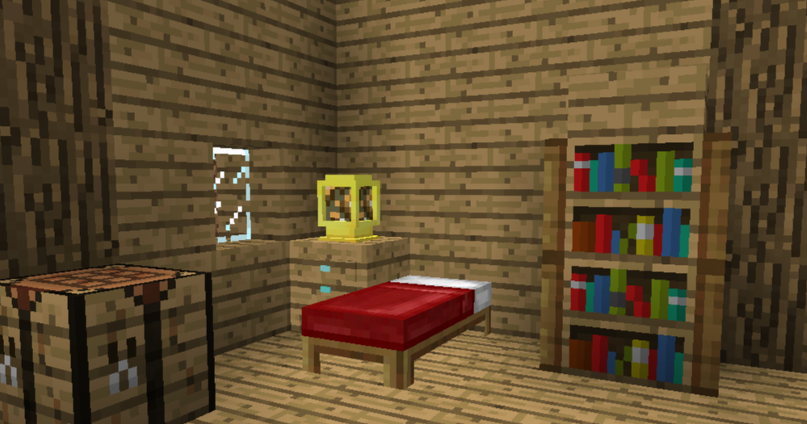
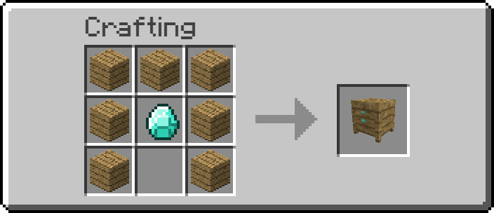
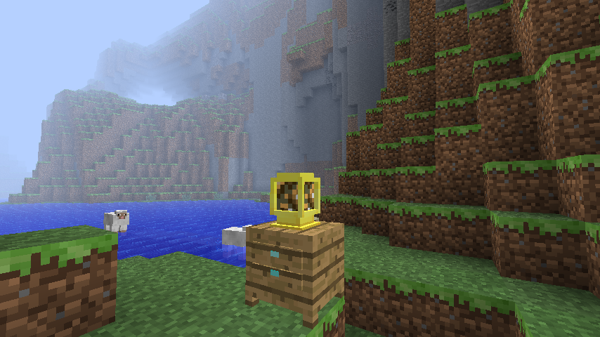
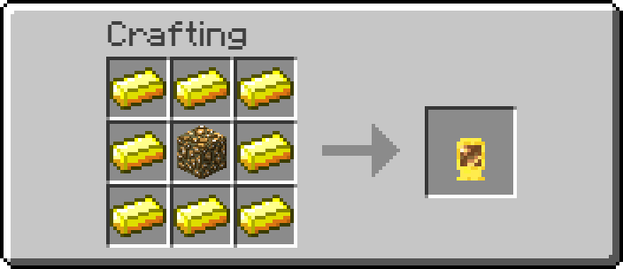

# Development Log

## Proper Progression Update

In development.

### Beds, but Endgame adaptation

A Minecraft 1.0 adaptation of [Beds, but Endgame](https://github.com/passziff/beds-but-endgame).

- A Bedside Table beside the head of the bed is required to sleep
- Beds still set the player's respawn point when sleep is denied
- A Glowstone Lamp on a valid Bedside Table prevents nightmares
- Nightmares wake the player and block sleeping again until daytime
- Nightmares do not occur shortly before dawn
- F6 cycles the time of day in singleplayer Creative

#### Bedside Table

#### Glowstone Lamp

